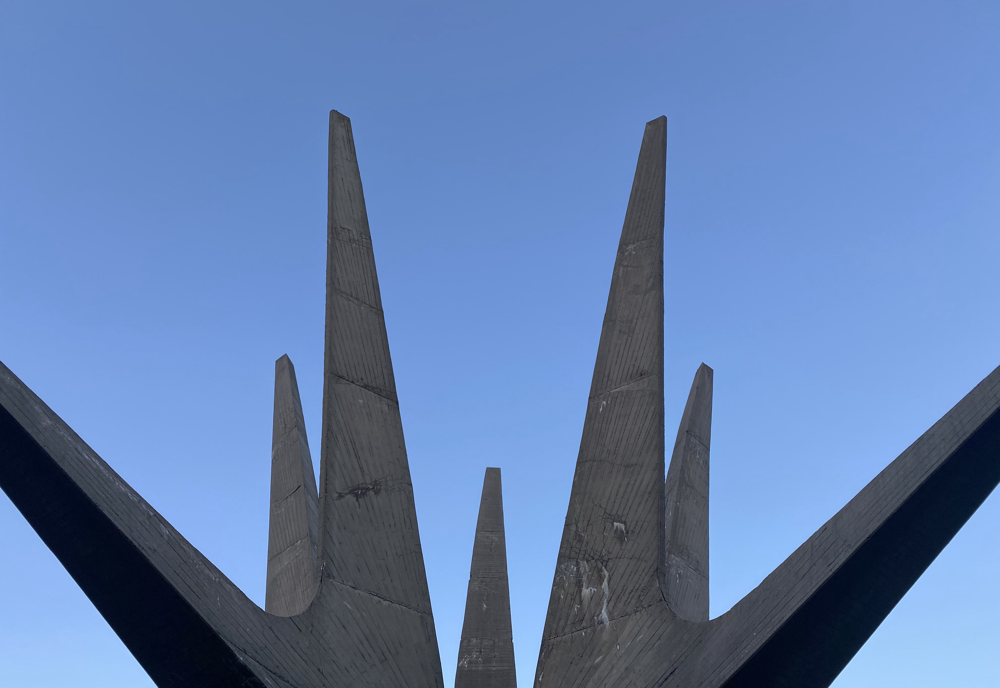

Beogradska izletišta često možemo izbrojati na prste, jedno od njih nisam posetio od školskih dana, a vrlo je moguće i nikada u životu. Iako je tu, na pola sata od centra grada, duboka brdovita šuma sa detaljem koji nikada neće izaći iz mode. Zaista je tako, socijalistički modernizam kao da poprima sve veće interesovanje iz godine u godinu. Moderno zauvek. Kao da raste strahopoštovanje svaki put kada se nađemo ispred tih masivnih betonskih spomenika, građenih upravo da pokažu svu moć sećanja i emocija u čije ime su podignuti.

> We can often count Belgrade picnic areas on our fingers, I have not visited one of them since my school days, and it is very possible and never in my life. Although there is, half an hour from the city center, a deep hilly forest with a detail that will never go out of fashion. Indeed, socialist modernism seems to be gaining more and more interest from year to year. Modern forever. It is as if awe grows every time we find ourselves in front of these massive concrete monuments, built just to show all the power of memories and emotions in whose name they were erected.

Kosmaj, pored fenomenalne prirode, vidikovca, staza za šetanje a od nedavno i pivare, čuva uspomenu na pale borce Kosmajskog partizanskog odreda poginule tokom ljute borbe protiv fašizma. Dok se iz podnožja približavate planini, iznad sada već žutih krošnji, uzdižu se kraci slobodarske iskre. Sloboda narodu. Iako se brutalizam kao pravac u arhitekturi, nastao posle Drugog svetstkog rata, fokusirao uvek na praktičnosti a ne lepoti, sa svog gledišta opovrgavam tvrdnju. Lično mislim da je brutalizam spoj one unutrašnje lepote odakle potiču sve emocije i grubih linija koje simbolišu snagu nakon svakog pada još jaču. Lepota koja ne izaziva pak nikakvu emociju, površan je obris i pokušaj. Ono što ni voda ne može ugasiti je večni plamen koji se nalazi u središnjem delu spomenika, a koji nadovezuje dalje simboliku ovog mesta. Pod jesenjom maglom, mistika pronalazi svoj put kroz objektive i pokušaje svih nas da na najbrutalniji način prikažemo stvarnost. Ipak, nije loše pročitati malo o istoriji ovog mesta pre posete, fotografije će svakako ispasti dobre.

> Kosmaj, in addition to its phenomenal nature, lookout point, walking path and, more recently, brewery, preserves the memory of the fallen fighters of the Kosmaj partisan detachment who died during the fierce fight against fascism. As you approach the mountain from the foothills, above the now yellow canopy, the sparks of the libertarian spark rise. Freedom to the people. Although brutalism as a direction in architecture, which emerged after the Second World War, always focused on practicality and not beauty, from my point of view I refute the claim. Personally, I think that brutalism is a combination of that inner beauty where all the emotions come from and the rough lines that symbolize strength after each fall are even stronger. Beauty that does not evoke any emotion is a superficial outline and an attempt. What even water cannot extinguish is the eternal flame that is located in the central part of the monument, and which further adds to the symbolism of this place. Under the autumn fog, mysticism finds its way through the lenses and attempts of all of us to present reality in the most brutal way. However, it is not bad to read a little about the history of this place before the visit, the photos will definitely turn out good.

Kada se umorite od svog tog tabananja i istorije, nastavite brutalni provod u obližnjoj pivari Kabinet. Sigurno ste čuli za ovu malu fabriku dobrog piva i identičnog druženja. Tokom letnjih meseci se možete izležavati na zelenoj i mekanoj poljani ispred zgrade, zimi ušuškani iza stakla uživati u pogledu. Arhitektura prati celodnevnu priču, minimalizam i industrijski dizajn cele zgrade višnja je na ovoj našoj torti. Iako torta i pivo ne idu baš zajedno.

> When you get tired of all that trampling and history, continue the brutal procession in the nearby brewery Kabinet. You must have heard of this small brewery of good beer and identical company. During the summer months you can lie down on the green and soft meadow in front of the building, in the winter tucked behind glass you can enjoy the view. The architecture follows the all-day story, minimalism and industrial design of the whole building is cherry on this cake of ours. Although cake and beer don’t really go together.

