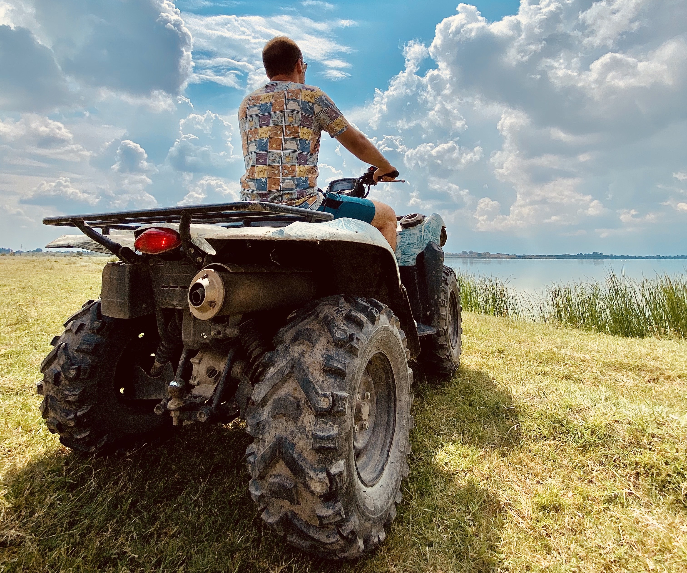

Beograd ima dosta parkova koje nekada branimo i golim rukama, ali je kadkad  potrebno napraviti par kilometara do oaze mira. Tamo gde beton ne postoji, drvo nam je i hlad, i pogled i klupa na kojoj sedimo. Da li ste ikada obilazili prirodni rezervat kvadovima? Da li ste vozili kvadove uopšte? Spremili smo za vas mnogo jaku preporuku – carski provod u Carskoj bari, prirodnom rezervatu nedaleko od Beograda koji obiluje florom i faunom, u kojem možete sresti razne životinje među kojima verovali ili ne – lamu. Simpatična alpaka smešne frizure dočekaće vas i ispratiti iz etno sela Tiganjica, odakle inače kreće obilazak rezervata. Čupavi momak je umiljat, jako voli da klopa, da pozira pred kamerama i svestan je svoje lepote.  Ne pljuje, ne morate bežati. Da se vratimo na obilazak, vožnja kvadovima traje oko sat i po vremena gde ćete imati priliku da obiđete Carsku baru, okolna jezera, kao i jako živopisno selo Belo blato sa smatram najlepšim drvoredom u ovom delu Srbije. Ukoliko volite adrenalin i avanture, nisam siguran šta čekate? Sa vama ide vodič od koga ćete dobiti sve instrukcije, tako da se nemojte plašiti ukoliko vam je ovo prvi put. Ne boli. Imao sam osećaj kao da smo u nekoj ekspediciji u potrazi za Big Futom ili drkavcem iz sela Gloganj. Mogao sam voziti još mnogo duže, zalaziti u svaki ćošak ove lepote, ali svakako nije preporučljivo voziti kvadove van staze koja je predviđena za to. Možemo ugroziti biljni ili žvotinjski svet, s toga budimo odgovorni pri svakoj poseti prirodi! Ono što vam još može biti zanimljivo, to je plovidba Starim Begejom, brodićem ili kanuom, gde džunglu možete posmatrati sa vode. Možete prošetati, voziti bajs. Biti bosi, goli nisam siguran. A kada ogladnite od tolike šetnje, vozikanja i svežeg vazduha, klopica u ovom selu je zagarantovano dobra. Sve je urađeno od prirodnih materijala, u etno stilu tako da će priroda još uvek biti oko vas. Rekrativno jahanje, mini zoološki vrt, smeštaj u bungalovima, opcije su u kojima možete uživati na ovom mestu. Dok ponovo ne krene kriza za betonom. Znam da vam nedostaje Beograd, zalazak sunca je trenutak kada se on budi. 

> Belgrade has a lot of parks that we sometimes defend with our bare hands, but sometimes it is necessary to make a few kilometers to an oasis of peace. Where concrete does not exist, wood is our shade, and the view and the bench on which we sit. Have you ever toured a nature reserve with quads? Have you driven quads at all? We have prepared a very strong recommendation for you - the royal guide in the Imperial pond, a nature reserve not far from Belgrade, which is rich in flora and fauna, where you can meet various animals, among whom you believe or not - the llama. A cute alpaca with a funny hairstyle will greet you and see you off from the ethno village of Tiganjica, from where a tour of the reserve usually starts. The shaggy guy is cute, he really likes to eat, to pose in front of the camera and he is aware of his beauty. Don't spit, you don't have to run. Let's go back to the tour, the quad ride takes about an hour and a half, where you will have the opportunity to visit the Imperial Bar, the surrounding lakes, as well as the very picturesque village of Belo Blato, which I consider the most beautiful tree line in this part of Serbia. If you like adrenaline and adventure, I'm not sure what to expect? A guide comes with you from when you will receive all the instructions, so don't be afraid if this is your first time. It does not hurt. I had the feeling that we were on an expedition in search of Big Foot or a jerk from the village of Gloganj. I could drive much longer, go into every corner of this beauty, but it is certainly not recommended to drive quads off the track that is provided for that. We can endanger the flora or fauna, so be responsible for every visit to nature! What may still be interesting to you is sailing the Old Begej, a boat or a canoe, where you can watch the jungle from the water. You can take a walk, ride a bike. Being barefoot, naked I’m not sure. And when you get hungry from so many walks, rides and fresh air, a meal in this village is guaranteed to be good. Everything is made of natural materials, in ethno style so that nature will still be around you. Recreational riding, mini zoo, accommodation in bungalows, are options you can enjoy in this place. Until the concrete crisis starts again. I know you miss Belgrade, the sunset is the moment when he wakes up.

