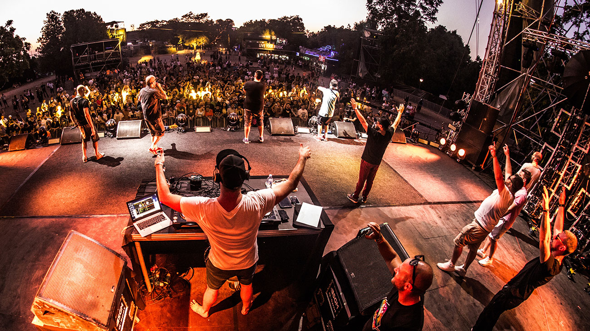
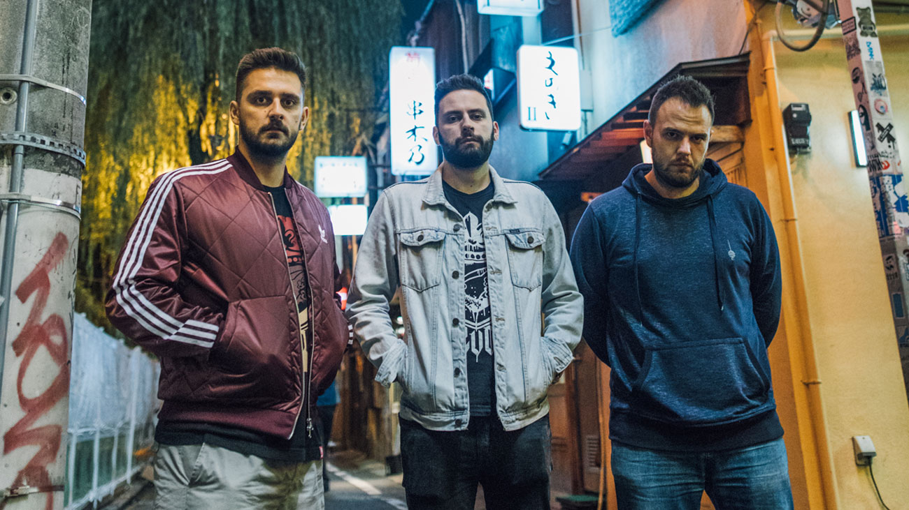
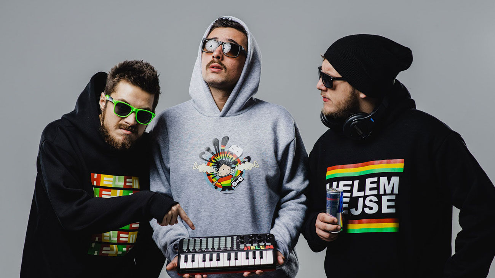

**Hip-hop festival unutar Exita objavio Bassivity zvezde i najjače hip-hop face iz celog regiona!**

Pravi hip-hop festival unutar festivala koji se sprema za ovogodišnji, po mnogima najjači EXIT ikada, upravo se uvećao za najtraženije hip-hop izvođače od Vardara do Triglava! Nakon što je za takozvanu EXIT Gang listu najavljeno preko 70 vodećih svetskih i regionalnih hip-hop zvezda među kojima su jedan od najznačajnijih svetskih repera **Skepta**, britanska trap-jazz senzacija **IAMDDB**, te američki reper **Desiigner**, tvorac jednog od najvećih hip-hop hitova ove decenije „Panda“! Iako je moćna regionalna reprezentacija već uključivala sve redom najslušanije repere sa ovih prostora, među kojima su i  **Vojko V, Krešo Bengalka, Bad Copy**, **Sajsi MC, Krankšvester, Atlas Erotika, High5, Buntai, Hazze, Klinac, Bekfleš** i drugi, ovaj impresivni spisak postao je upravo duplo duži! Na EXIT, sad već tradicionalno, stiže najjača postava vodeće regionalne hip-hop kuće **Bassivity**, koju će na Addiko Fusion bini u subotu 6. jula predstavljati njihovi superpopularni izvođači kao što su balkanska senzacija **Senidah,** lirički majstori **Surreal i Fox,** zagrebački hit trio **KUKU$,** mlada zvezda **Elon** i specijalna gošća **Sara Jo**, a čiji hitovi u zbiru prelaze i vrtoglave brojke od **100 miliona YouTube pregleda!** Veliku regionalnu postavu kompletiraju i crnogorski dvojac **Who See,** energične Sarajlije **Helem nejse,** nadaleko poštovani FM Jam trio **Frenkie Kontra i Indigo,** te heroj iz beogradskog Vijetnama, **Smoke Mardeljano**! Na **Cockta Beats** binu dolazi i **Bassivity** **DJ ekipa Bajko Felix i Luka Brasi**, a na novu binu stižu još i **Kojot**, **Ognjen,** **Nina Davis** i **Yan Dusk**!

> **Hip-hop festival within Exit announced Bassivity stars and the strongest hip-hop faces from all over the region!**
>
> \
> The real hip-hop festival within the festival, which is preparing for this year's, according to many the strongest EXIT ever, has just increased for the most sought-after hip-hop performers from Vardar to Triglav! After over 70 leading world and regional hip-hop stars were announced for the so-called EXIT Gang list, including one of the world's most important rappers **Skepta**, British trap-jazz sensation **IAMDDB**, and American rapper **Desiigner**, creator of one of the biggest hip-hop hits of this decades of "Panda"! Although the powerful regional team has already included all the most listened rappers from this area, including **Vojko V, Krešo Bengalka, Bad Copy, Sajsi MC, Krankšvester, Atlas Erotika, High5, Buntai, Hazze, Klinac, Bekfleš** and others, this impressive the list has just become twice as long! The strongest line-up of the leading regional hip-hop house **Bassivity** is coming to EXIT, now traditionally, which will be presented on the Addiko Fusion stage on Saturday, July 6 by their super-popular performers such as the Balkan sensation **Senidah**, lyrical masters **Surreal and Fox**, Zagreb hit trio **KUKU$**, young star **Elon** and special guest **Sara Jo**, whose hits together exceed the dizzying numbers of 100 million YouTube views! The large regional line-up is completed by the Montenegrin duo **Who See**, the energetic Sarajevans **Helem nejse**, the widely respected FM Jam trio **Frenkie Kontra and Indigo**, and the hero from Belgrade Vietnam, **Smoke Mardeljano**! The Bassivity DJ team Bajko Felix and Luka Brasi are also coming to the Cockta Beats stage, and **Kojot, Ognjen, Nina Davis** and **Yan Dusk** are also coming to the new stage!

**EXIT Gang se povećao za udarne hip-hop zvezde regiona:**

<iframe width="560" height="315" src="https://www.youtube.com/embed/Y6pnaaLfNTM" frameborder="0" allow="accelerometer; autoplay; clipboard-write; encrypted-media; gyroscope; picture-in-picture" allowfullscreen></iframe>

Hip-hop pejzaž u regionu nemoguće je naslikati bez imena **Bassivity**, prve izdavačke kuće u Srbiji koja je objavljivala i albume hrvatskih repera, a ova, danas vodeća balkanska izdavačka kuća u proteklih 20 godina zabeležila je preko 50 izdatih albuma. Brojni su svoje karijere počeli kroz Bassivity, a zabeleženi su i prvi albumi Marčela, Struke i Šortija, te saradnje sa imenima kao što su Raekwon, French Montana i Unkle Murda, i producentima svetskih zvezda poput Lejdi Gage! Posle par prethodnih izdanja, ovogodišnji **Bassivity Showcase na EXIT** donosi svoja najaktuelnija imena među kojima su Filip Arsenijević, poznatiji kao **Surreal**, zbog kojeg je čitav Balkan „u gasu“ i koji je uz trap gurua **Foxa** uveo novi hip-hop stil u svakodnevnicu na ovim prostorima. Branko Kljaić **Fox**, inače novosadski student filozofije, na EXIT donosi megahitove kao što su „Šurim bika“, „Influencer“ i „Fuccboi“, a društvo će im praviti famozni zagrebački trio **KUKU$**, sa kojim su obojica zabeležili prve velike hitove u tekućoj godini.

> It is impossible to paint the hip-hop landscape in the region without the name **Bassivity**, the first record label in Serbia to publish albums by Croatian rappers, and this, today the leading Balkan record label, has recorded over 50 albums in the past 20 years. Many have started their careers through Bassivity, and the first albums of Marcello, Struka and Shorty have been recorded, as well as collaborations with names such as Raekwon, French Montana and Unkle Murda, and producers of world stars such as Lady Gaga! After a couple of previous releases, this year's **Bassivity Showcase on EXIT** brings its most current names, including Filip Arsenijević, better known as **Surreal**, because of which the whole Balkans is "on gas" and who, with the trap of guru **Fox**, introduced a new hip-hop style into everyday life. spaces. Branko Kljaić Fox, a student of philosophy from Novi Sad, brings megahits such as "Šurim bika", "Influencer" and "Fuccboi" to EXIT, and they will be accompanied by the famous Zagreb trio **KUKU$**, with whom they both recorded their first big hits in the current years.

Tu je i prva dama regionalne hip-hop i R’n’B scene, moćna **Senidah** balkanska muzička senzacija i vlasnica megahita „Slađana“, koji danas broji preko vrtoglavih 36 miliona YouTube pregleda, a uspeh prvog sa još nekoliko desetina miliona ispratili i naredni singlovi, čime se Slovenka crnogorskog porekla danas svrstava u red najtraženijih izvođača na Balkanu. Njen album prvenac „Bez tebe“ zacementirao je njen uspeh uz neizbežne singlove „Crno srce“, „Bez tebe“, „Nisi bio tu“, „Belo“ i, naravno, „Slađana“ dok je njen aktuleni hit „Mišići“ pokazao i njen pun mejnstrim potencijal. Bassivity nema problem da poput vodećih hip-hop kolektiva u svetu, pod svoju etiketu potpiše i punokrvne pop zvezde, pa na EXIT stiže i **Sara Jo**, koja je za samo nekoliko meseci „pokupila“ preko pet miliona pregleda sa najnovijom numerom „Bez sna“! Bassivity postavu na Addiko Fusion bini zaokružiće i subotički vunderkind **Elon**, dok se zvanična after žurka ove izdavačke kuće posle nastupa na gornjem gradu tvrđave, seli u donji pravo na Cockta Beats binu, gde će miks pult da preuzmu Bassivity DJ majstori **Bajko Felix** i **Luka Brasi!** Na sceni ove nove bine naći će se underground majstor **Kojot** i trap autor hita „Siena“ **Ognjen**, dok će za afrobeat biti zadužena **Nina Davis**, a publici Exita predstaviće se i novo lice domaće rap scene **Yan Dusk**!

> There is also the first lady of the regional hip-hop and R'n'B scene, the powerful **Senidah** Balkan music sensation and the owner of the megahit "Sladjana", which today has over a dizzying 36 million YouTube views, and the success of the first with several tens of millions followed the next singles, which makes the Slovene of Montenegrin origin one of the most sought-after performers in the Balkans today. Her debut album "Bez tebe" cemented her success with the inevitable singles "Crno srce", "Bez tebe", "Nisi bio tu", "Belo" and, of course, "Sladjana", while her current hit "Mišići" also showed its full mainstream potential. Bassivity has no problem signing full-blooded pop stars under its label, like the leading hip-hop collectives in the world, so **Sara Jo** arrives at EXIT, who "picked up" over five million views with the latest song "Without a Dream" in just a few months. !! Bassivity line-up on the Addiko Fusion stage will be rounded off by Subotica's prodigy **Elon**, while the official after party of this publishing house after the performance in the upper town of the fortress, moves to the lower right on the Cockta Beats stage, where Bassivity DJ masters **Bajko Felix and Luka Brasi** will take over the mixing desk!! On the stage of this new stage will be underground master **Kojot** and trap author of the hit "Siena" **Ognjen**, while **Nina Davis** will be in charge of the afrobeat, and the audience of Exit will be introduced to the new face of the domestic rap scene **Yan Dusk**!

Pored najavljenog dolaska hip-hop heroja Bad Copy i Sajsi MC, Fusion ekipu upotpuniće i Dedduh i Noiz, poznatiji kao obožavani kotorski tandem **Who See** koji je nedavno „zapalio“ region još jednom hit pesmom, „Naselje“,  kao i sastav koji je temelj izgradio na hip-hop zvuku, ali nadogradio sa uticajima reggae, dancehall, dub i etno zvuka – **Helem nejse**, koji na EXIT stiže na krilima željno iščekivanog drugog albuma „Pola čovjek pola jedan“, na kojem sarađuju sa Markom Louisom, ali i Frenkijem, koji čini jednu trećinu talentovane MC, rap i producentske ekipe **Frenkie Kontra i Indigo** koja je uticala na ovdašnju hip-hop scenu, te je sasvim prikladno da i oni stanu na jednu od najvećih bina EXIT festivala. Iskrenu životnu priču upakovanu u impresivni flow doneće **Smoke Mardeljano**, mladić koji je underground scenu u Srbiji i šire krenuo da osvaja sa pesmom „Ja repujem“, a od tada je zabeležio saradnje sa Prti Bee Gee, Who See i drugima, dok druga iskusna imena ove scene ne prestaju da ga uzdižu zbog njegovog freestyle talenta.

> In addition to the announced arrival of hip-hop heroes Bad Copy and Sajsi MC, the Fusion team will be completed by Dedduh and Noiz, better known as the adored Kotor tandem **Who See**, which recently "ignited" the region with another hit song, "Naselje", as well as the foundation. built on hip-hop sound, but upgraded with the influences of reggae, dancehall, dub and ethno sound - **Helem nejse**, who arrives at EXIT on the wings of the eagerly awaited second album "Half man half one", on which they collaborate with Mark Louis, but also Frankie , which makes up one third of the talented MC, rap and production team of **Frenkie, Kontra and Indigo** who influenced the local hip-hop scene, and it is quite appropriate for them to step on one of the biggest stages of the EXIT festival. An honest life story packed in an impressive flow will be brought by **Smoke Mardeljano**, a young man who started to conquer the underground scene in Serbia and beyond with the song "I rap", and since then he has recorded collaborations with Prti Bee Gee, Who See and others, while other experienced names these scenes do not cease to elevate him because of his freestyle talent.

**Jednodnevne EXIT ulaznice odlaze brže nego ikad!**

Pojedinačne ulaznice za drugi, treći i četvrti dan EXIT festivala nedavno su imale najjači star prodaje otkako se prodaju onlajn širom planete, a za publiku sa ovih prostora, dostupne su već po ceni od samo **2.690 dinara**, što je čak 35% uštede u odnosu na njihove finalne cene. Ulaznice za prvi festivalski dan, 4. jul, kada nastupaju rok giganti The Cure prodaju se po ceni od **2.990 dinara** za parter i **4.990 dinara** za FAN PIT, dok je cena GOLD VIP dnevnih ulaznica za 4. jul 12.000 dinara. Još uvek traje i popularna “4+1” akcija, u kojoj društvo koje zajedno kupi četiri ulaznice za EXIT festival, petu dobija na poklon, a ove četvorodnevne ulaznice trenutno su **6.990** dinara, što je i dalje visokih **45% uštede** u odnosu na finalnu cenu! Ulaznice za EXIT mogu se nabaviti preko zvanične stranice [exitfest.org](https://www.exitfest.org/) i putem [prodajne mreže](http://www.gigstix.com/prodajna-mesta-gde-kupiti-ulaznice) Gigs Tix. Na sajtu zvanične turističke agencije [exittrip.org](https://www.exittrip.org/rs), dostupni su i turistički paketi koji pored ulaznica, sadrže i razne opcije za smeštaj i prevoz.

> **One-day EXIT tickets go faster than ever!**
>
> Individual tickets for the second, third and fourth day of the EXIT festival recently had the strongest old sales since they were sold online around the planet, and for the audience from this area, they are available at a price of only **2,690 dinars**, which is 35% savings compared to their final prices. Tickets for the first day of the festival, July 4, when rock giants The Cure perform, are sold at a price of **2,990 dinars** for the ground floor and **4,990 dinars** for FAN PIT, while the price of GOLD VIP daily tickets for July 4 is 12,000 dinars. The popular "4 + 1" campaign is still going on, in which the company that buys four tickets for the EXIT festival together gets a fifth as a gift, and these four-day tickets are currently **6,990 dinars**, which is still a high **45% savings** compared to the final price! Tickets for EXIT can be purchased through the official website exitfest.org and through the Gigs Tix sales network. On the website of the official travel agency exittrip.org, tourist packages are also available, which, in addition to tickets, also contain various options for accommodation and transportation.